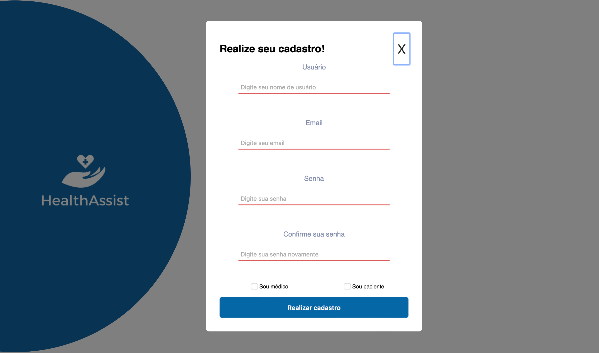
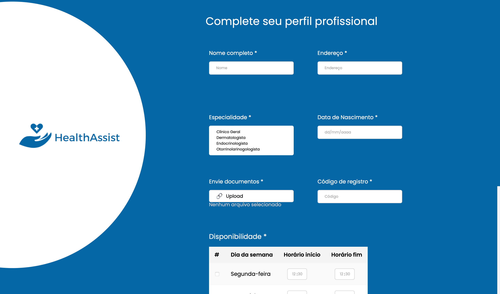
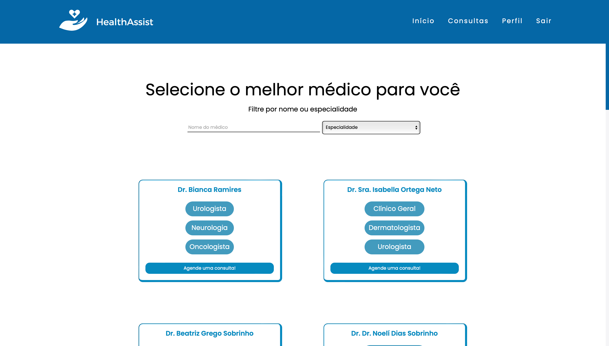
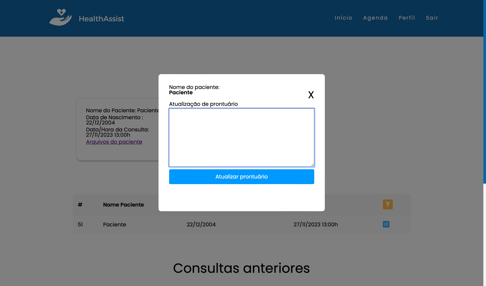
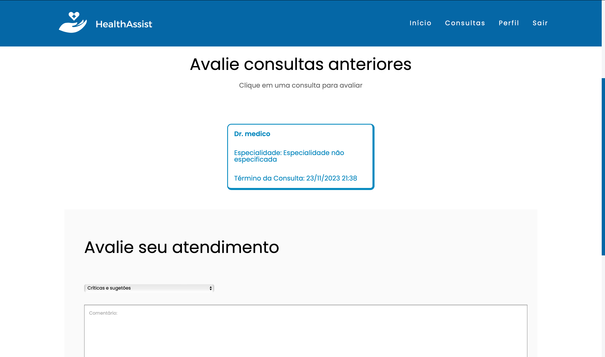

## 6. Interface do sistema

Visão geral da interação do usuário pelas telas do sistema. Apresente as principais interfaces da plataforma. 

## 6.1. Telas principal do sistema

### Tela inicial do sistema, onde são exibidas informações institucionais da HealthAssist.
> 
### Tela de registro, onde são adicionados dados como usuário, e-mail, definição de senha e tipo do usuário (médico ou paciente).
> 
### Tela de login, onde o usuário adicionará seus dados e será redirecionado para concluir seu cadastro de acordo com seu perfil.
> 

## 6.1. Telas do processo gerenciar médico

### Tela de criação do perfil do médico, onde o mesmo completa seus dados com informações pessoais, profissionais, horários disponíveis para atendimento, envia seus documentos e aguarda a aprovação de seu perfil por parte da clínica.
> 
### Tela de confirmação, onde a secretária da clínicia analisa os dados do médico e aceita ou rejeita seu cadastro.
> 

## 6.1. Telas do processo gerenciar paciente

### Tela de criação do perfil do paciente, onde o mesmo completa seus dados com informações pessoais, envia seus documentos e registros médicos e aguarda sua aprovação de perfil por parte da clínica.
> 
### Tela de confirmação, onde a secretária da clínica analisa os dados do médico e aceita ou rejeita seu cadastro.
> 

## 6.1. Telas do processo gerenciar consultas online

### Tela onde o paciente pode agendar sua consulta, podendo realizar sua busca pelo por especialidade ou nome do profissional desejado.
> 
### Tela onde o paciente escolhe o melhor horário para sua consulta depois de ter escolhido o profissional desejado.
> 

## 6.1. Tela do processo gerenciar horários

### Tela onde o médico pode visualizar e gerenciar suas consultas.
> 

## 6.1. Tela do processo realizar consulta

### Tela onde o médico pode atualizar o prontuário do paciente após a anamnese realizada durante a consulta.
> 

## 6.1. Tela do processo avaliar consulta

### Tela onde o paciente pode avaliar uma consulta, podendo se decidir entre avaliar o atendimento médico, avaliar o atendimento da clínica ou críticas e sugestões gerais.
> 
