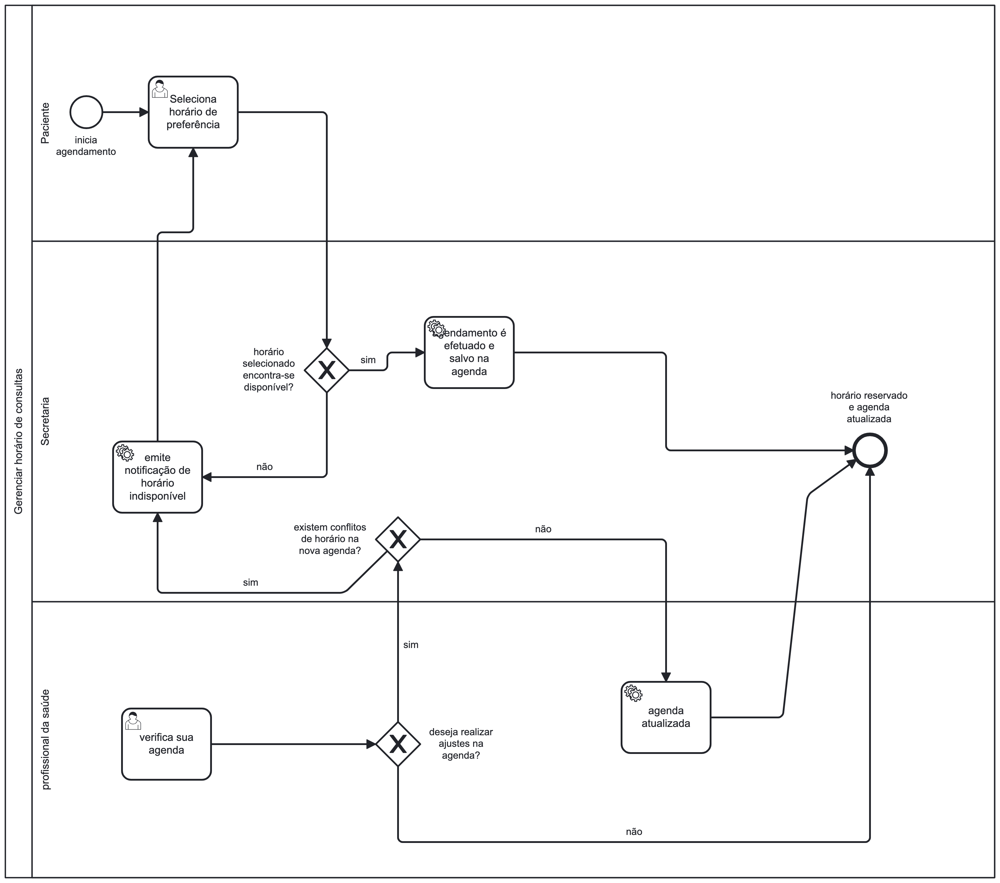

### 3.3.1 Processo 1 – Gerenciar horários

O processo de gerenciamento de horários de consulta é mister para o funcionamento da uma clíinica onde as atividades dependem de horários marcados pré-definidos para funcionarem, logo a necessidade deste processo. Um bom processo de gerenciamento de horários afeta positivamente o funcionamento da empresa, como a satisfação dos pacientes. Este processo tem como objetivo simplificar o dia a dia do paciente e dos profissionais da clínica, possibilitando aos mesmos acesso direto e facilitado à agenda.

#### Detalhamento das atividades

O gerenciamento de horários acontecerá em três momentos na plataforma. No primeiro momento, quando um paciente desejar agendar um novo horário. Neste caso, o sistema deverá verificar se há conflitos de horário, caso contrário, a agenda será atualizada. Caso hajam conflitos, o cliente será notificado e convidado a escolher um novo horário. No segundo momento, quando um profissional da saúde desejar alterar sua agenda, o mesmo poderá fazer as alterações que desejar no sistema, mesmo que hajam conflitos de horário. Para os conflitos gerados, o sistema deverá notificar o paciente, e o mesmo deverá escolher um novo horário que o atenda. Em um terceiro momento, quando o paciente desejar alterar um horário que já tenha agendado, o mesmo deverá solicitar uma alteração de horários e selecionar um novo horário. Caso não hajam conflitos, o novo horário será salvo, caso hajam, o usuário será convidado a escolher um novo horário.

Os tipos de dados a serem utilizados são:

* **Área de texto** - campo texto de múltiplas linhas
* **Caixa de texto** - campo texto de uma linha
* **Número** - campo numérico
* **Data** - campo do tipo data (dd-mm-aaaa)
* **Hora** - campo do tipo hora (hh:mm:ss)
* **Data e Hora** - campo do tipo data e hora (dd-mm-aaaa, hh:mm:ss)
* **Imagem** - campo contendo uma imagem
* **Seleção única** - campo com várias opções de valores que são mutuamente exclusivos (tradicional radio button ou combobox)
* **Seleção múltipla** - campo com várias opções que podem ser selecionadas mutuamente (tradicional checkbox ou listbox)
* **Arquivo** - campo de upload de documento
* **Link** - campo que armazena uma URL
* **Tabela** - campo formado por uma matriz de valores

**Visualizar médicos e clínicas**

| **Campo**       | **Tipo**         | **Restrições** | **Valor default** |
| ---             | ---              | ---            | ---               |
| Avaliações dos serviços prestados | Tabela  |       -         |           -        |

**Verificar disponibilidade**

| **Campo**       | **Tipo**         | **Restrições** | **Valor default** |
| ---             | ---              | ---            | ---               |
| Disponibilidade | Seleção única  |          -      |       -            |
|                 |                  |                |                   |

| **Comandos**         |  **Destino**                   | **Tipo**          |
| ---                  | ---                            | ---               |
| [Nome do botão/link] | Atividade/processo de destino  | (default/cancel/  ) |
|                      |                                |                   |
