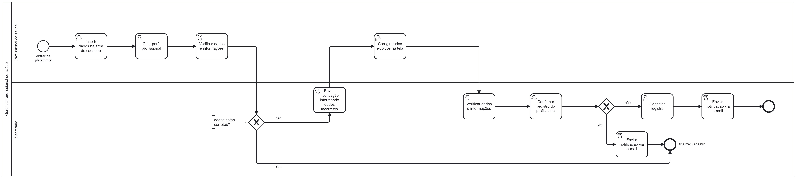

### 3.3.3 Processo 1 – GERENCIAR MÉDICO
O processo de Gerenciar Médico tem como objetivo manter um registro preciso e atualizado de todos os profissionais médicos e de saúde associados à clínica, garantindo que eles estejam disponíveis para consultas, atualizando suas informações pessoais e profissionais. Assim, a existência deste cadastro de forma online traz benefícios significativos para a clínica. Isso porque permite a edição das informações e facilita o controle a todos os profissionais.

#### Detalhamento das atividades

**Inserir dados na área de cadastro**

| **Campo**       | **Tipo**         | **Restrições** | **Valor default** |
| ---             | ---              | ---            | ---               |
| Nome | Caixa de texto  |      Mínimo de 2 caracteres        |           -        |
| Endereço | Caixa de texto  |    -            |        -           |
| Idade | Número  |                |                   |
| Data de Nascimento | Data |        -        |    -               |
| Código de registro | Caixa de texto |        -        |    -               |
| Especialidade médica | Caixa de texto |        -        |    -               |
| Arquivos pessoais | Arquivos |            -            |                   |

| **Comandos**         |  **Destino**                   | **Tipo** |
| ---                  | ---                            | ---               |
| Cadastrar |  Enviar dados para cadastro  | Confirm |
| Cancelar |  Cancela envio dos dados  | Cancel |

**Inserir disponibilidades e horários**

| **Campo**       | **Tipo**         | **Restrições** | **Valor default** |
| ---             | ---              | ---            | ---               |
| Especialidade de atendimento | Caixa de texto  |       -         |           -        |
| Horários disponíveis | Tabela |    -            |        -           |

| **Comandos**         |  **Destino**                   | **Tipo** |
| ---                  | ---                            | ---               |
| Enviar |  Envia os dados para análise pela secretária  | Confirm |
| Cancelar |  Cancela envio dos dados  | Cancel |

**Verificar dados e informações**

| **Campo**       | **Tipo**         | **Restrições** | **Valor default** |
| ---             | ---              | ---            | ---               |
| Visualizar dados | Tabela  |       Conflito de horários        |           -        |

| **Comandos**         |  **Destino**                   | **Tipo** |
| ---                  | ---                            | ---               |
| Autorizar |  Autoriza o cadastro do profissional e envia os dados para montagem da agenda | Confirm |
| Cancelar |  Cancela cadastro e envia notificação ao profissional  | Cancel |

**Montar agenda do profissional**

| **Campo**       | **Tipo**         | **Restrições** | **Valor default** |
| ---             | ---              | ---            | ---               |
| Agenda pessoal | Tabela  |       -         |           -        |

| **Comandos**         |  **Destino**                   | **Tipo** |
| ---                  | ---                            | ---               |
| Enviar |  Envia a agenda para o profissional  | Confirm |
| Cancelar |  Cancela envio dos dados  | Cancel |