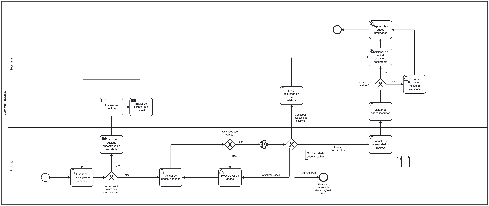

### 3.3.2 Processo 2 – GERENCIAR PACIENTE

  Hoje em dia, a gestão de paciente em muitas clínicas ainda se mostra antiquada e pouco eficiente. Ela é conduzida de forma manual, onde um funcionário da clínica é encarregado de registrar as informações pessoais de um paciente. Assim o processo que estamos desenvolvendo tem como objetivo otimizar essa tarefa e reduzir as chances de erros. Agora, o próprio paciente terá a capacidade de cadastrar-se remotamente na plataforma, inserindo suas informações pessoais, seus documentos e receber seus exames de maneira automatizada.

#### Detalhamento das atividades

Os tipos de dados a serem utilizados são:

* **Área de texto** - campo texto de múltiplas linhas
* **Caixa de texto** - campo texto de uma linha
* **Número** - campo numérico
* **Data** - campo do tipo data (dd-mm-aaaa)
* **Hora** - campo do tipo hora (hh:mm:ss)
* **Data e Hora** - campo do tipo data e hora (dd-mm-aaaa, hh:mm:ss)
* **Imagem** - campo - contendo uma imagem
* **Seleção única** - campo com várias opções de valores que são mutuamente exclusivos (tradicional radio button ou combobox)
* **Seleção múltipla** - campo com várias opções que podem ser selecionadas mutuamente (tradicional checkbox ou listbox)
* **Arquivo** - campo de upload de documento
* **Link** - campo que armazena uma URL
* **Tabela** - campo formado por uma matriz de valores

**Cadastrar paciente**

| **Campo**       | **Tipo**         | **Restrições** | **Valor default** |
| ---             | ---              | ---            | ---               |
| Cadastrar | Caixa de Texto  |          -      |            -       |

| **Comandos**         |  **Destino**                   | **Tipo** |
| ---                  | ---                            | ---               |
| Cadastrar            | Início do proceso de cadastro  |      -             |

