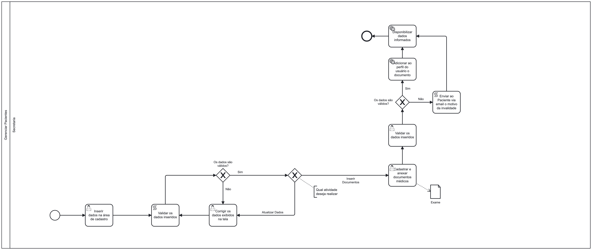

### 3.3.2 Processo 2 – GERENCIAR PACIENTE

  Hoje em dia, a gestão de paciente em muitas clínicas ainda se mostra antiquada e pouco eficiente. Ela é conduzida de forma manual, onde um funcionário da clínica é encarregado de registrar as informações pessoais de um paciente. Assim o processo que estamos desenvolvendo tem como objetivo otimizar essa tarefa e reduzir as chances de erros. Agora, o próprio paciente terá a capacidade de cadastrar-se remotamente na plataforma, inserindo suas informações pessoais, seus documentos e receber seus exames de maneira automatizada.

#### Detalhamento das atividades

Os tipos de dados a serem utilizados são:

* **Área de texto** - campo texto de múltiplas linhas
* **Caixa de texto** - campo texto de uma linha
* **Número** - campo numérico
* **Data** - campo do tipo data (dd-mm-aaaa)
* **Hora** - campo do tipo hora (hh:mm:ss)
* **Data e Hora** - campo do tipo data e hora (dd-mm-aaaa, hh:mm:ss)
* **Imagem** - campo - contendo uma imagem
* **Seleção única** - campo com várias opções de valores que são mutuamente exclusivos (tradicional radio button ou combobox)
* **Seleção múltipla** - campo com várias opções que podem ser selecionadas mutuamente (tradicional checkbox ou listbox)
* **Arquivo** - campo de upload de documento
* **Link** - campo que armazena uma URL
* **Tabela** - campo formado por uma matriz de valores

**Detalhamento das atividades**

**Inserir os dados para o cadastro**

| **Campo**       | **Tipo**         | **Restrições** | **Valor default** |
| ---             | ---              | ---            | ---               |
| Nome | Caixa de texto  |      Mínimo de 2 caracteres        |           -        |
| Endereço | Caixa de texto  |    -            |        -           |
| Idade | Número  |                |                   |
| Data de Nascimento | Data |        -        |    -               |
| Código de registro | Caixa de texto |        -        |    -               |

| **Comandos**         |  **Destino**                   | **Tipo** |
| ---                  | ---                            | ---               |
| Cadastrar |  Enviar dados para cadastro  | Confirm |
| Cancelar |  Cancela envio dos dados  | Cancel |

**Enviar as dúvidas encontradas a secretária**

| **Campo**       | **Tipo**         | **Restrições** | **Valor default** |
| ---             | ---              | ---            | ---               |
| Ticket | Número  |       -         |           -        |
| Titulo | Caixa de texto |    -            |        -           |
| Descrição | Caixa de texto |    -            |        -           |

| **Comandos**         |  **Destino**                   | **Tipo** |
| ---                  | ---                            | ---               |
| Enviar |  Envia os ticket para análise pela secretária  | Confirm |
| Cancelar |  Cancela envio do ticket  | Cancel |

**Analisar as dúvidas**

| **Campo**       | **Tipo**         | **Restrições** | **Valor default** |
| ---             | ---              | ---            | ---               |
| Visualizar dados | Tabela  |               |           -        |

| **Comandos**         |  **Destino**                   | **Tipo** |
| ---                  | ---                            | ---               |
| Responder |  É direcinado para uma página de para realizar a reposta do ticket | Confirm |
| Cancelar |  Não reponde ao ticket momentaneamente   | Cancel |

**Enviar ao cliente uma resposta**

| **Campo**       | **Tipo**         | **Restrições** | **Valor default** |
| ---             | ---              | ---            | ---               |
| Ticket Resposta | Número  |       -         |           -        |
| Titulo | Caixa de texto |    -            |        -           |
| Descrição | Caixa de texto |    -            |        -           |

| **Comandos**         |  **Destino**                   | **Tipo** |
| ---                  | ---                            | ---               |
| Enviar |  Envia os ticket para análise pela secretária  | Confirm |
| Cancelar |  Cancela envio do ticket  | Cancel |

**Validar os dados inseridos**

| **Campo**       | **Tipo**         | **Restrições** | **Valor default** |
| ---             | ---              | ---            | ---               |
| Visualizar dados | Tabela  |               |           -        |

| **Comandos**         |  **Destino**                   | **Tipo** |
| ---                  | ---                            | ---               |
| Confirmar |  Direncionar para a página do perfil | Confirm |
| Cancelar |  Não reponde ao ticket momentaneamente   | Cancel |

**Reescrever os dados**

| **Campo**       | **Tipo**         | **Restrições** | **Valor default** |
| ---             | ---              | ---            | ---               |
| Nome | Caixa de texto  |      Mínimo de 2 caracteres        |           -        |
| Endereço | Caixa de texto  |    -            |        -           |
| Idade | Número  |                |                   |
| Data de Nascimento | Data |        -        |    -               |
| Código de registro | Caixa de texto |        -        |    -               |

| **Comandos**         |  **Destino**                   | **Tipo** |
| ---                  | ---                            | ---               |
| Cadastrar |  Enviar dados para atualização do perfil  | Confirm |
| Cancelar |  Cancela envio dos dados  | Cancel |

**Cadastrar e anexar dados médicos**

| **Campo**       | **Tipo**         | **Restrições** | **Valor default** |
| ---             | ---              | ---            | ---               |
| Titulo | Caixa de texto  |      Mínimo de 2 caracteres        |           -        |
| Descrição | Caixa de texto  |    -            |        -           |
| Resultado | Arquivo  |                |                   |
| Data de Resultado | Data |        -        |    -               |

| **Comandos**         |  **Destino**                   | **Tipo** |
| ---                  | ---                            | ---               |
| Inserir |  Enviar Dados  | Confirm |
| Cancelar |  Cancelar o envio dos dados  | Cancel |

**Validar os dados inseridos de Anexos de Documentos **
| **Campo**       | **Tipo**         | **Restrições** | **Valor default** |
| ---             | ---              | ---            | ---               |
| Visualizar dados | Tabela  |               |           -        |

| **Comandos**         |  **Destino**                   | **Tipo** |
| ---                  | ---                            | ---               |
| Inserir | Confirmar os Anexos fonecidos  | Confirm |
| Cancelar |  Cancelar os dados enviado  | Cancel |

**Enviar resultado dos exames médicos**

| **Campo**       | **Tipo**         | **Restrições** | **Valor default** |
| ---             | ---              | ---            | ---               |
| Titulo | Caixa de texto  |      Mínimo de 2 caracteres        |           -        |
| Descrição | Caixa de texto  |    -            |        -           |
| Resultado | Arquivo  |                |                   |
| Data do Resultado | Data |        -        |    -               |
| Data da Consulta | Data |        -        |    -               |

| **Comandos**         |  **Destino**                   | **Tipo** |
| ---                  | ---                            | ---               |
| Inserir |  Enviar Dados  | Confirm |
| Cancelar |  Cancela envio dos dados  | Cancel |

**Enviar ao Paciente o motivo da invalidade**
| **Campo**       | **Tipo**         | **Restrições** | **Valor default** |
| ---             | ---              | ---            | ---               |
| Titulo | Caixa de texto  |      Mínimo de 2 caracteres        |           -        |
| Descrição | Caixa de texto  |    -            |        -           |
| Resultado | Arquivo  |                |                   |

| **Comandos**         |  **Destino**                   | **Tipo** |
| ---                  | ---                            | ---               |
| Inserir |  Enviar motivos  | Confirm |
| Cancelar |  Cancela envio dos motivos  | Cancel |

