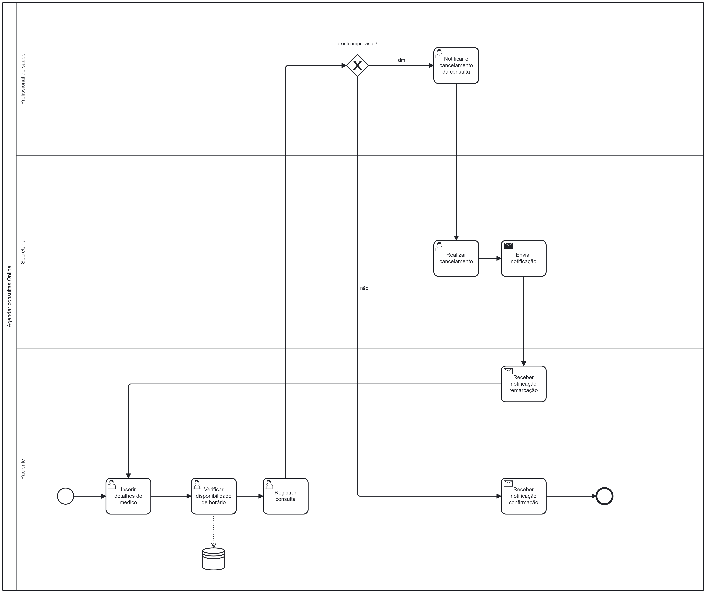

### 3.3.5 Processo 3 – GERENCIAR CONSULTA ONLINE

O processo de gerenciamento das consultas online é mister para o funcionamento da uma clíinica onde as atividades dependem de horários marcados pré-definidos para funcionarem, logo a necessidade deste processo. Um bom processo de gerenciamento de horários afeta positivamente o funcionamento da empresa, como a satisfação dos pacientes. Este processo tem como objetivo simplificar o dia a dia do paciente e dos profissionais da clínica, possibilitando aos mesmos acesso direto e facilitado à agenda.

#### Detalhamento das atividades

Descreva aqui cada uma das propriedades das atividades do processo 6. 
Devem estar relacionadas com o modelo de processo apresentado anteriormente.

**Registrar consulta**

| **Campo**       | **Tipo**         | **Restrições** | **Valor default** |
| ---             | ---              | ---            | ---               |
| Especialidades disponíveis | Seleção única  |      campo com várias opções de valores que são mutuamente exclusivos          |                   |
| Nome do médico | Seleção única  |      campo com várias opções de valores que são mutuamente exclusivos          |                   |
| Data | Data  |      dd-mm-aaaa          |       hoje (dd-mm-aaaa)            |
| Horário | Hora  |      hh:mm:ss          |       00:00:00           |

| **Comandos**         |  **Destino**                   | **Tipo** |
| ---                  | ---                            | ---               |
| Salvar | Fim do Processo 3  |  |

**Cancelamento da consulta**

| **Campo**       | **Tipo**         | **Restrições** | **Valor default** |
| ---             | ---              | ---            | ---               |
| Consultas | Tabela  |            |                  |

| **Comandos**         |  **Destino**                   | **Tipo** |
| ---                  | ---                            | ---               |
| Cancelar | Reinicia o Processo 3  |  |