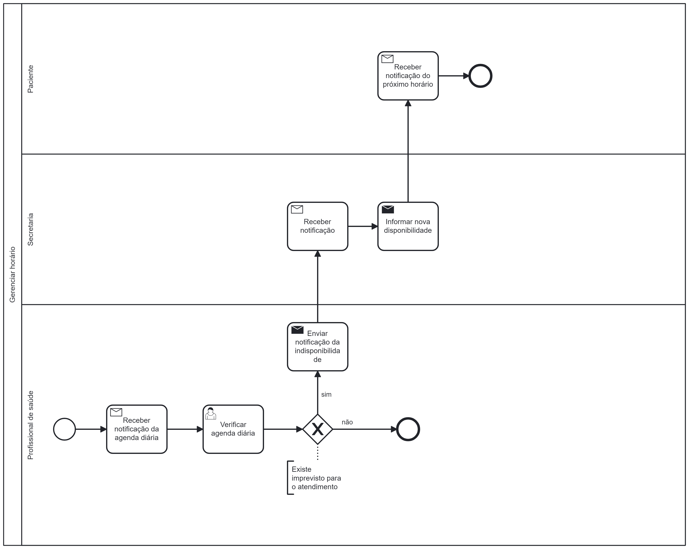

### 3.3.1 Processo 4 – GERENCIAR HORÁRIOS

O gerenciamento de horários, pode impactar na melhoria da clínica ao otimizar a alocação de recursos e melhorar a eficiência operacional, garantindo que os horários estejam bem distribuídos e evitando sobrecargas ou ociosidade da equipe dos profissionais de saúde. Um bom processo de gerenciamento de horários afeta positivamente o funcionamento da empresa, como a satisfação dos pacientes, gerando um efeito positivo em todos envolvidos no processo, do paciente até o profissional de saúde,

#### Detalhamento das atividades

O gerenciamento de horários acontecerá na plataforma assim que o médico começar seu expediente. Ao começar seu expediente, o médico irá verificar sua agenda para o dia, contendo todos seus agendamentos que já foram previamente agendados para aquele dia, assim como seu expediente de trabalho. Dado isso, caso o médico queira, por ventura, cancelar um ou mais horários deu seu expediente, o mesmo poderá fazê-lo sem maiores preocupações. Uma vez um pedido de alteração de agenda tenha sido lançado pelo médico, o sistema deverá verificar se há conflitos de horário, ou seja, se existem consultas agendadas naquele intervalo de tempo que foi solicitada a alteração, caso contrário, a agenda será atualizada no sistema para refletir as solicitações do médico, também para evitar que encaixes sejam feitos naqueles horários. Caso hajam conflitos, o cliente será notificado.

**Verificar agenda diária**

| **Campo**       | **Tipo**         | **Restrições** | **Valor default** |
| ---             | ---              | ---            | ---               |
| Agenda  | Data e Hora  |      conflitos de horário (dd-mm-aaaa, hh:mm:ss)       |                  |
|          Nome do Paciente       |    Tabela              |               |                   |
|          Idade do Paciente       |    Tabela              |               |            |

| **Comandos**         |  **Destino**                   | **Tipo**          |
| ---                  | ---                            | ---               |
| Detalhes | Tabela  |  |
