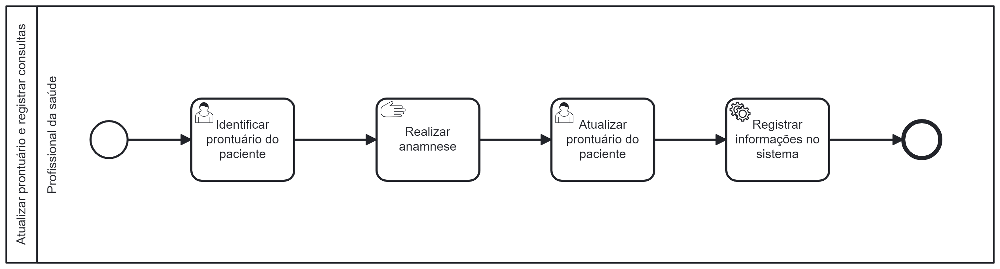

### 3.3.5 Processo 5 – ATUALIZAR PRONTUÁRIO E REGISTRAR CONSULTAS

O processo de Atualizar Prontuário e Registrar Consultas tem como objetivo manter registros médicos precisos e atualizados dos pacientes, garantindo que todas as informações relevantes das consultas sejam registradas adequadamente. Isso inclui detalhes sobre o histórico médico, diagnósticos, tratamentos, prescrições e qualquer outra informação importante relacionada às consultas médicas. Este processo modernizado melhora a qualidade da assistência médica, fortalece a conformidade regulatória e aprimora a continuidade do cuidado ao paciente, substituindo eficazmente um processo anteriormente propenso a imprecisões e ineficiências.
 

#### Detalhamento das atividades

O rating de profissionais acontecerá em dois momentos na plataforma. Primeiramente, ao fim de uma consulta o usuário/cliente que foi consultado será convidado através de um e-mail enviado pelo sistema a avaliar sua experiência com o médico e a clínica como um todo. Caso o usuário opte por não visualizar o e-mail, o mesmo ainda poderá avaliar sua consulta através do site, bastando apenas visualizar a consulta em questão na aba de histórico de consultas, podendo este então avaliar a consulta através do botão avaliar. Ambos caminhos irão direcionar o usuário a um formulário de avaliação, onde serão feitas perguntas para apurar e quatificar a satisfação do mesmo.

Os tipos de dados a serem utilizados são:

* **Área de texto** - campo texto de múltiplas linhas
* **Caixa de texto** - campo texto de uma linha
* **Número** - campo numérico
* **Data** - campo do tipo data (dd-mm-aaaa)
* **Hora** - campo do tipo hora (hh:mm:ss)
* **Data e Hora** - campo do tipo data e hora (dd-mm-aaaa, hh:mm:ss)
* **Imagem** - campo - contendo uma imagem
* **Seleção única** - campo com várias opções de valores que são mutuamente exclusivos (tradicional radio button ou combobox)
* **Seleção múltipla** - campo com várias opções que podem ser selecionadas mutuamente (tradicional checkbox ou listbox)
* **Arquivo** - campo de upload de documento
* **Link** - campo que armazena uma URL
* **Tabela** - campo formado por uma matriz de valores

**Rating dos Profissionais**

| **Campo**       | **Tipo**         | **Restrições** | **Valor default** |
| ---             | ---              | ---            | ---               |
| [Dar nota ao Profissional] | [tipo de dados]  |                |                   |

| **Comandos**         |  **Destino**                   | **Tipo** |
| ---                  | ---                            | ---               |
| [Avaliar ] | Número de 1-5 representando qualidade do serviço  | (número  ) |

**Rating da Clínica**

| **Campo**       | **Tipo**         | **Restrições** | **Valor default** |
| ---             | ---              | ---            | ---               |
| [Dar nota a Clinica] | [numéro ]  |                |                   |
|                 |                  |                |                   |

| **Comandos**         |  **Destino**                   | **Tipo**          |
| ---                  | ---                            | ---               |
| [Avaliar ] | Número de 1-5 representando qualidade do serviço  | (número ) |
|                      |                                |                   |
