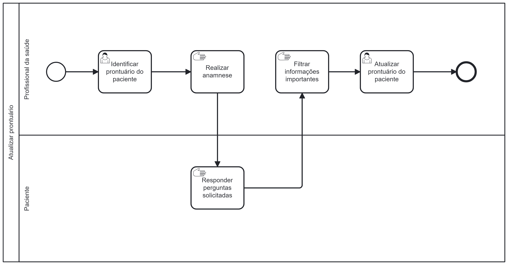

### 3.3.5 Processo 5 – ATUALIZAR PRONTUÁRIO

O processo de Atualizar Prontuário tem como objetivo manter registros médicos precisos e atualizados dos pacientes, garantindo que todas as informações relevantes das consultas sejam registradas adequadamente. Isso inclui detalhes sobre o histórico médico, diagnósticos, tratamentos, prescrições e qualquer outra informação importante relacionada às consultas médicas. Este processo modernizado melhora a qualidade da assistência médica, fortalece a conformidade regulatória e aprimora a continuidade do cuidado ao paciente, substituindo eficazmente um processo anteriormente propenso a imprecisões e ineficiências.
 

#### Detalhamento das atividades

Os tipos de dados a serem utilizados são:

* **Área de texto** - campo texto de múltiplas linhas
* **Caixa de texto** - campo texto de uma linha
* **Número** - campo numérico
* **Data** - campo do tipo data (dd-mm-aaaa)
* **Hora** - campo do tipo hora (hh:mm:ss)
* **Data e Hora** - campo do tipo data e hora (dd-mm-aaaa, hh:mm:ss)
* **Imagem** - campo - contendo uma imagem
* **Seleção única** - campo com várias opções de valores que são mutuamente exclusivos (tradicional radio button ou combobox)
* **Seleção múltipla** - campo com várias opções que podem ser selecionadas mutuamente (tradicional checkbox ou listbox)
* **Arquivo** - campo de upload de documento
* **Link** - campo que armazena uma URL
* **Tabela** - campo formado por uma matriz de valores

**Identificar prontuário do paciente**

| **Campo**       | **Tipo**         | **Restrições** | **Valor default** |
| ---             | ---              | ---            | ---               |
| Visualizar dados | Tabela  |     Cliente não cadastrado           |         -          |

**Atualizar prontuário do paciente**

| **Campo**       | **Tipo**         | **Restrições** | **Valor default** |
| ---             | ---              | ---            | ---               |
| Data e Hora da consulta        | Data e hora          | -            |  -    |
| Nome do médico   | Caixa de texto  |      Mínimo de 3 caracteres	       |  - |
| Especialidade médica | Caixa de texto |        -        |    -               |
| Respostas da anamnese |         Área de texto         |        -        |  -  |

| **Comandos**         |  **Destino**                   | **Tipo**             |
| ---                  | ---                            | ---                  |
|       Atualizar      |  Atualiza dados do prontuário  |       Confirm        |
|       Cancelar       | Cancela atualização dos dados do prontuário |  Cancel |
