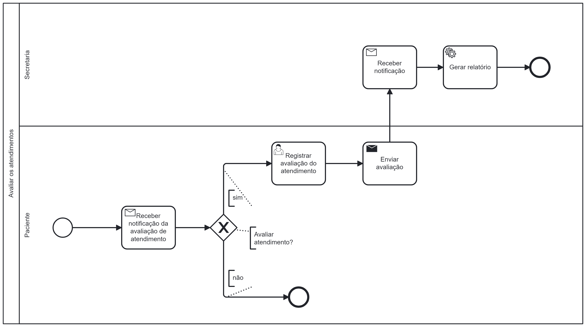

### 3.3.4 Processo 6 – AVALIAR CONSULTAS E ATENDIMENTOS

O processo de avaliação do atendimento pode ser útil para mensurar a qualidade do atendimento oferecido pela empresa como um todo. Esse processo de melhoria de qualidade afeta muito positivamente a continuidade da empresa, como aumento da satisfação com os pacientes, reputação, competitividade e eficiência operacional.

#### Detalhamento das atividades

Descreva aqui cada uma das propriedades das atividades do processo 4. 
Devem estar relacionadas com o modelo de processo apresentado anteriormente.

**Registrar avaliação do atendimento**

| **Campo**       | **Tipo**         | **Restrições** | **Valor default** |
| ---             | ---              | ---            | ---               |
| Avaliar | Seleção única  |      campo com várias opções de valores que são mutuamente exclusivos (min: 1 - max: 5)         |        0            |
| Comentário | Caixa de texto  |      400 caracteres          |                   | 

| **Comandos**         |  **Destino**                   | **Tipo** |
| ---                  | ---                            | ---               |
| Salvar | Fim do Processo 6  |  |

**Avaliar a qualidade através do histórico**
| **Campo**       | **Tipo**         | **Restrições** | **Valor default** |
| ---             | ---              | ---            | ---               |
| Período  | Data e Hora  |     (dd-mm-aaaa, hh:mm:ss)       |                  |
| Informações  | Tabela  |            |                  |

| **Comandos**         |  **Destino**                   | **Tipo** |
| ---                  | ---                            | ---               |
| Gerar relatório | Fim do Processo 6  |  |
