## 4. Projeto da solução

### 4.1. Diagrama de classes

_Acrescente uma breve descrição sobre o diagrama apresentado. Descreva cada uma de suas classes._

### 4.2. Diagrama de componentes

_Apresente o diagrama de componentes da aplicação, indicando os elementos da arquitetura e as interfaces entre eles. Faça uma descrição sucinta dos componentes indicando o papel de cada um deles dentro da arquitetura/estilo/padrão arquitetural. Indique também quais componentes serão reutilizados (navegadores, SGBDs, middlewares, etc), quais componentes serão adquiridos por serem proprietários e quais componentes precisam ser desenvolvidos._

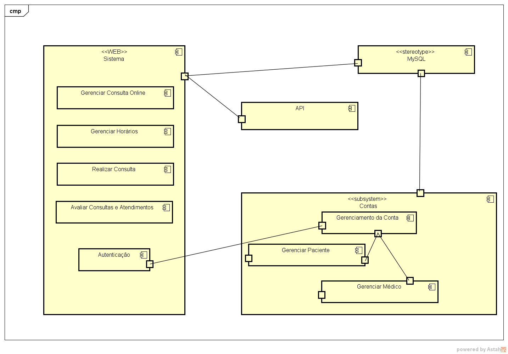

_Apresente uma descrição detalhada dos artefatos que constituem o diagrama de componentes._

Exemplo: conforme diagrama apresentado, as entidades participantes da solução são:

- **Componente 1** - Lorem ipsum dolor sit amet, consectetur adipiscing elit. Cras nunc magna, accumsan eget porta a, tincidunt sed mauris. Suspendisse orci nulla, sagittis a lorem laoreet, tincidunt imperdiet ipsum. Morbi malesuada pretium suscipit.
- **Componente 2** - Praesent nec nisi hendrerit, ullamcorper tortor non, rutrum sem. In non lectus tortor. Nulla vel tincidunt eros.

### 4.3. Modelo de dados

_Apresente o modelo de dados por meio de um modelo relacional ou Diagrama de Entidade-Relacionamento (DER) que contemple todos os conceitos e atributos apresentados no item anterior._ 

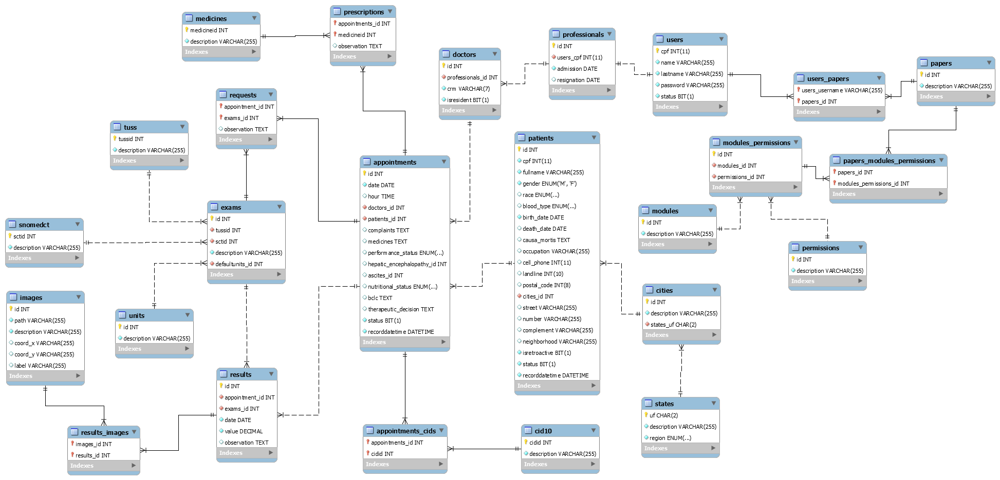

### 4.4. Tecnologias

| **Dimensão**   | **Tecnologia**  |
| ---            | ---             |
| Persistência   | Hibernate       |
| Front end      | HTML+CSS+JS     |
| Back end       | Java SpringBoot |
| Log do sistema | Log4J           |
| Teste          | JUnit           |
| Deploy         | Github Pages    |

### 4.5. Guias de estilo

Layout padrão do site (HTML e CSS) que será utilizado em todas as páginas com a definição de identidade visual, aspectos de responsividade e iconografia.

##### Menu padrão
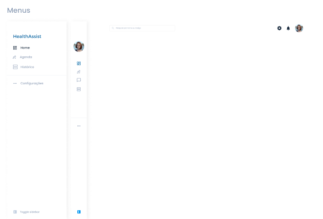

## Design
##### Logo

##### Login
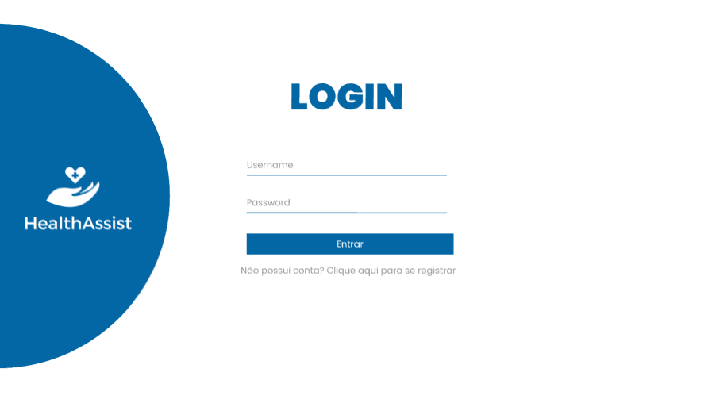

##### Cadastro Médico
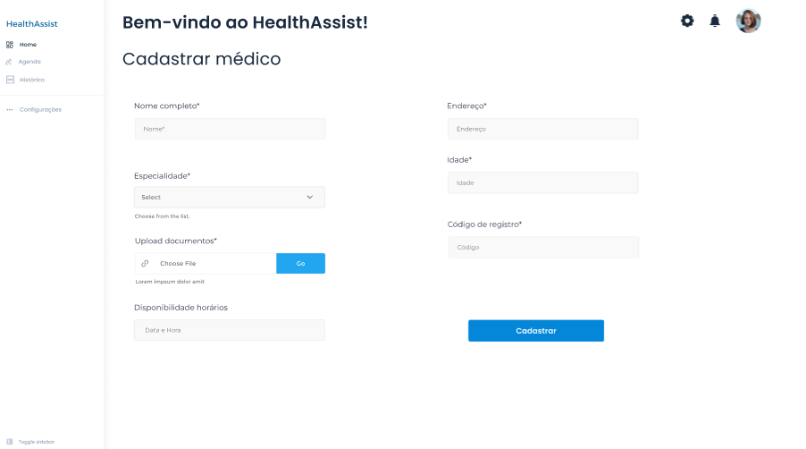

##### Cadastro Paciente
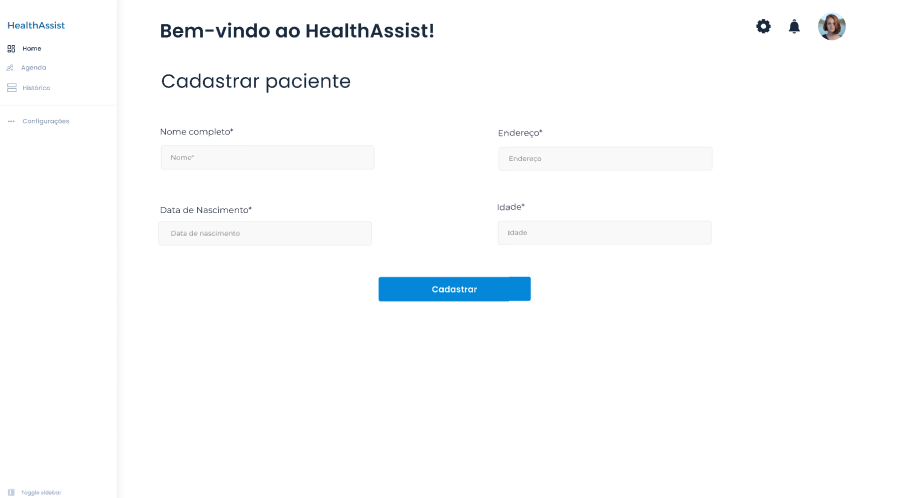

##### Tela Médico
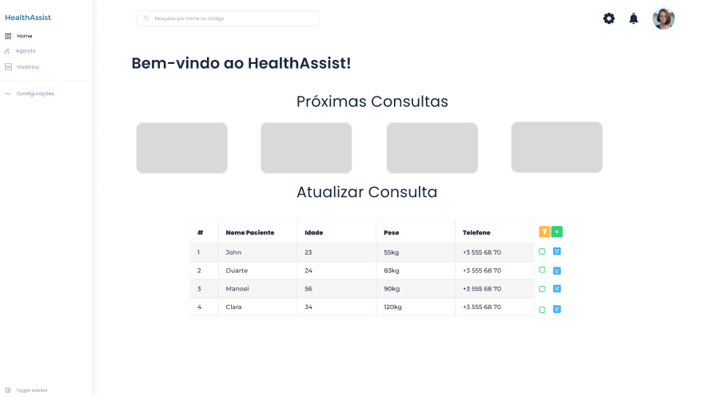

##### Tela Paciente
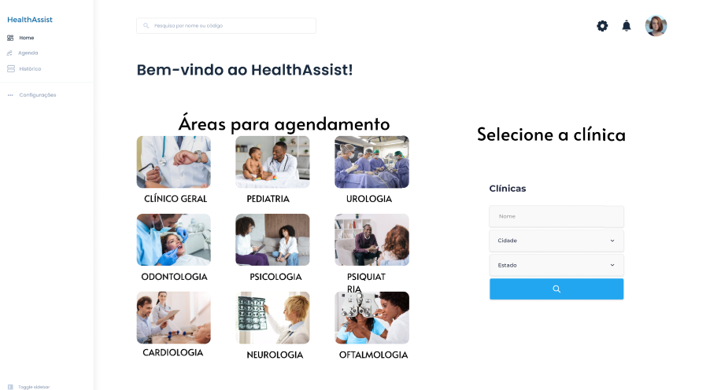

##### Visualizar Agenda
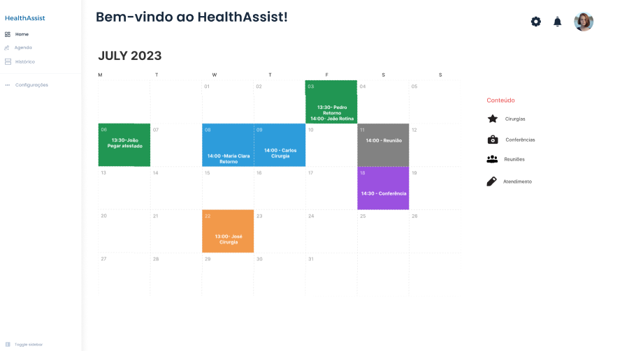

##### Avaliar atendimento
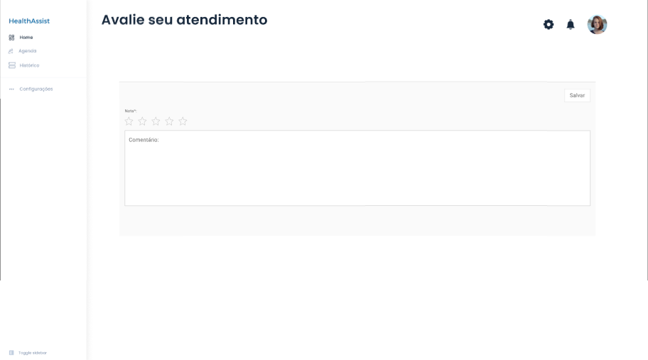

## Cores

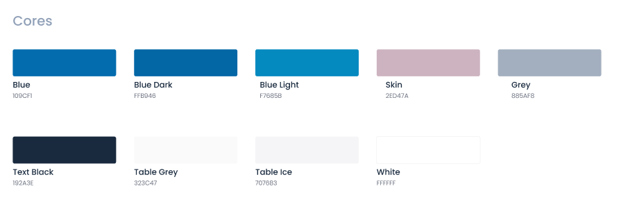

## Tipografia

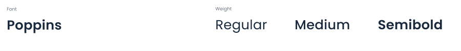

## Iconografia

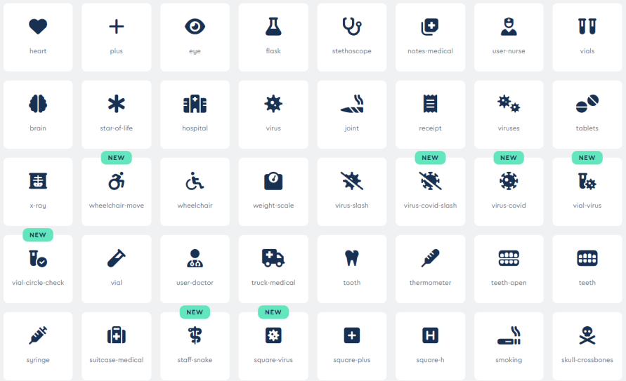

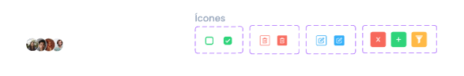

