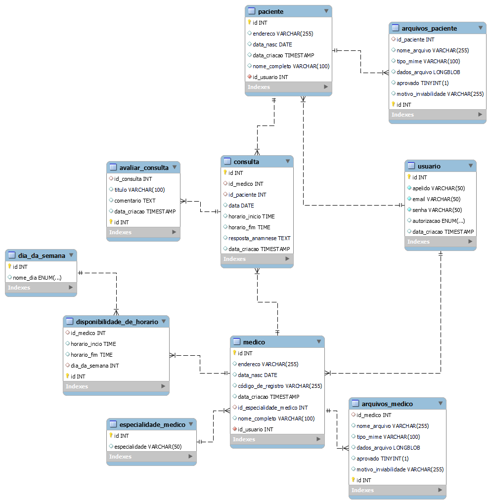

## 4. Projeto da solução

### 4.1. Diagrama de classes

A classe "Medico" contém informações relevantes, como nome, especialização, CRM e detalhes de contato. O método editarAgenda permitem que os profissionais de saúde gerenciem suas agendas, otimizando a gestão de consultas.

A classe "AgendaDoMedico" inclui informações sobre os horários disponíveis para consultas. Esta classe é essencial para otimizar a coordenação de consultas médicas, evitando conflitos de horário e garantindo uma distribuição equilibrada das consultas. Além disso, a classe inclui o método "cancelarConsulta" para permitir o cancelamento de consultas agendadas quando necessário.

A classe "Paciente" representa os indivíduos em busca de atendimento médico. Ela armazena informações essenciais, como o nome do paciente e detalhes de contato. Os métodos associados a esta classe incluem a capacidade de agendar, cancelar e avaliar consultas e visualizar prontuário, assim melhorando a experiência do paciente.

A classe "Prontuário" é responsável por armazenar informações detalhadas sobre o histórico médico dos pacientes. Ela inclui dados como diagnósticos, tratamentos anteriores e qualquer outra informação relevante relacionada às consultas médicas. O prontuário é uma parte fundamental da assistência médica, pois fornece um registro completo e atualizado da saúde do paciente, permitindo que os profissionais de saúde tomem decisões informadas. Essa classe desempenha um papel crucial na melhoria da qualidade da assistência médica e na continuidade do cuidado ao paciente.

A classe "Consulta" mantém informações sobre consultas médicas, como data, hora, paciente, médico e estado da consulta (agendada, realizada, cancelada, etc.), além de avaliações do usuário. Os métodos relacionados a esta classe permitem a atualização do estado da consulta e atualização do prontuário do paciente.

Descrição: A classe "LembreteDeConsulta" cuida dos lembretes enviados aos pacientes e médicos para informa-los sobre os status de cada consulta(agendada, realizada, cancelada). Ela armazena informações como mensagem do lembrete, data e hora e destinatários(médico e paciente). O método associado a esta classe se refere ao envio destes lembretes.

### 4.2. Diagrama de componentes

_Apresente o diagrama de componentes da aplicação, indicando os elementos da arquitetura e as interfaces entre eles. Faça uma descrição sucinta dos componentes indicando o papel de cada um deles dentro da arquitetura/estilo/padrão arquitetural. Indique também quais componentes serão reutilizados (navegadores, SGBDs, middlewares, etc), quais componentes serão adquiridos por serem proprietários e quais componentes precisam ser desenvolvidos._

_Apresente uma descrição detalhada dos artefatos que constituem o diagrama de componentes._

Exemplo: conforme diagrama apresentado, as entidades participantes da solução são:

- **Componente 1** - Lorem ipsum dolor sit amet, consectetur adipiscing elit. Cras nunc magna, accumsan eget porta a, tincidunt sed mauris. Suspendisse orci nulla, sagittis a lorem laoreet, tincidunt imperdiet ipsum. Morbi malesuada pretium suscipit.
- **Componente 2** - Praesent nec nisi hendrerit, ullamcorper tortor non, rutrum sem. In non lectus tortor. Nulla vel tincidunt eros.

### 4.3. Modelo de dados

_Apresente o modelo de dados por meio de um modelo relacional ou Diagrama de Entidade-Relacionamento (DER) que contemple todos os conceitos e atributos apresentados no item anterior._ 

### 4.4. Tecnologias

| **Dimensão**   | **Tecnologia**  |
| ---            | ---             |
| Persistência   | Hibernate       |
| Front end      | HTML+CSS+JS     |
| Back end       | Java SpringBoot |
| Log do sistema | Log4J           |
| Teste          | JUnit           |
| Deploy         | Github Pages    |

### 4.5. Guias de estilo

Layout padrão do site (HTML e CSS) que será utilizado em todas as páginas com a definição de identidade visual, aspectos de responsividade e iconografia.

## Design
##### Logo 1

##### Logo 2

##### Login

##### Menu padrão

<!-- ##### Cadastro Médico

##### Cadastro Paciente

##### Tela Médico

##### Tela Paciente

##### Visualizar Agenda

##### Avaliar atendimento
 -->

## Cores

## Tipografia

 ##### Título: será utilizado Semibold
 ##### Conteúdo de texto: será utilizado Regular

## Iconografia

