# 7. Testes da solução

## Testes de Inspeção

**Caso de Teste** | **CT01.1 - Cadastrar usuário**
 :--------------: | ------------
**Procedimento**  | Cadastrar novo usuário. 
**Dados de entrada** | Inserção de dados válidos no formulário de cadastro. 
**Resultado obtido** | Dado cadastrado com sucesso no Banco de Dados. 

**Registro do Teste:**

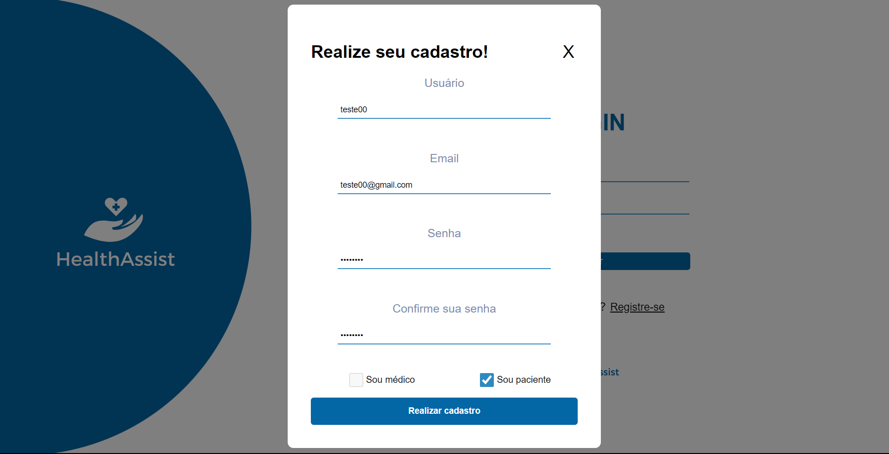
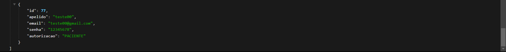

**Caso de Teste** | **CT01.2 - Cadastrar usuário já existente**
 :--------------: | ------------
**Procedimento**  | Cadastrar usuário já existente.
**Dados de entrada** | Inserção de dados válidos com nome de usuário já existente no banco.
**Resultado obtido** | Dado não cadastrado, invalidação do BackEnd.

**Registro do Teste:**

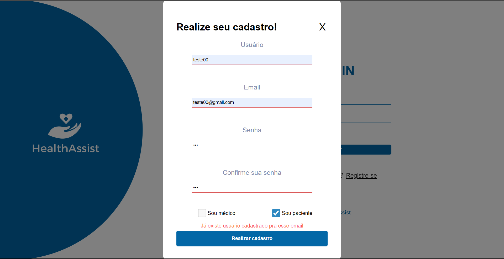

**Caso de Teste** | **CT02.1 - Médico: Criar perfil profissinal**
 :--------------: | ------------
**Procedimento**  | Criar perfil profissional no HealthAssist.
**Dados de entrada** | Inserção de dados válidos.
**Resultado obtido** | Dado cadastrado, salvamento no Banco de Dados, esperando confirmação ou rejeição do sistema interno.

**Registro do Teste:**

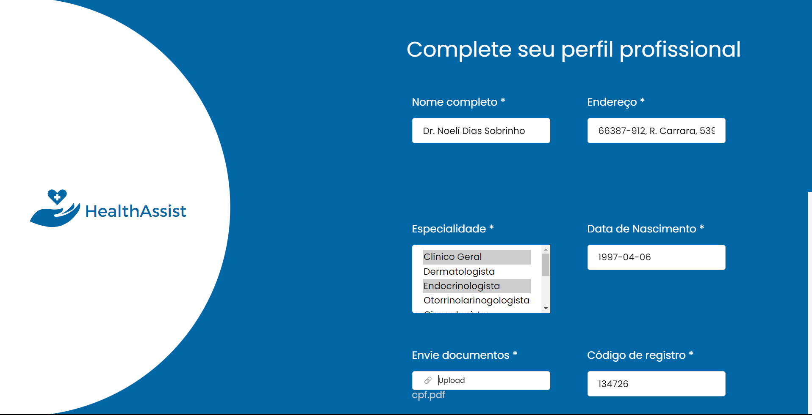
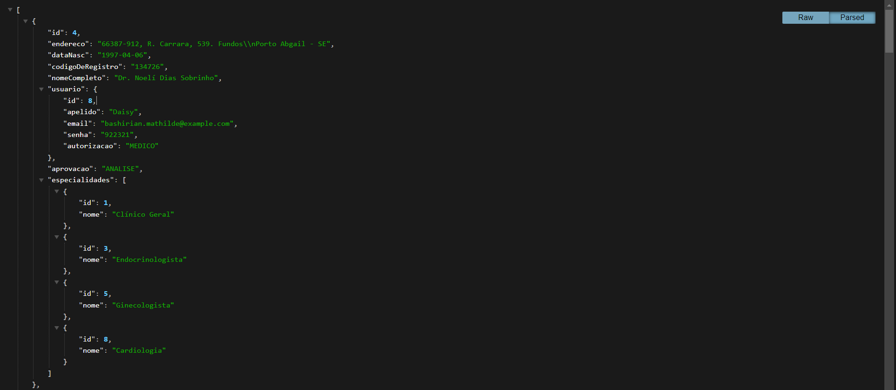

**Caso de Teste** | **CT02.2 - Médico: Acessar HealthAssist sem aprovação do sistema**
 :--------------: | ------------
**Procedimento**  | Acessar site sem ser aprovado pela administração da clínica.
**Dados de entrada** | Realizar login com seu email e senha.
**Resultado obtido** | Entrada não autorizada.

**Registro do Teste:**

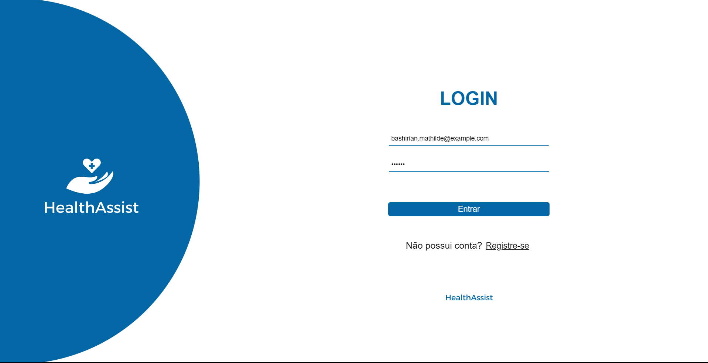

**Caso de Teste** | **CT03.1 - Paciente: Criar perfil**
 :--------------: | ------------
**Procedimento**  | Criar perfil no HealthAssist.
**Dados de entrada** | Inserção de dados válidos.
**Resultado obtido** | Dado cadastrado, salvamento no Banco de Dados, esperando confirmação ou rejeição do sistema interno.

**Registro do Teste:**

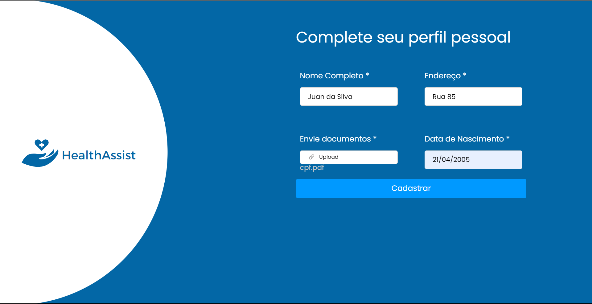
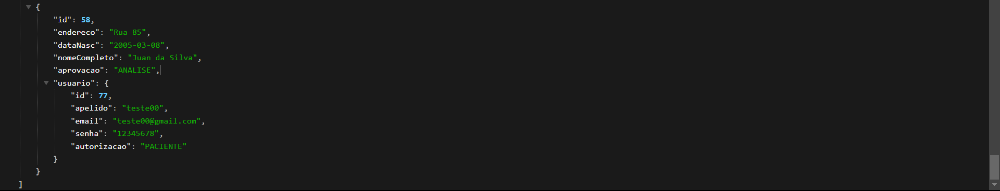

**Caso de Teste** | **CT03.2 - Paciente: Acessar HealthAssist sem aprovação do sistema**
 :--------------: | ------------
**Procedimento**  | Acessar site sem ser aprovado pela administração da clínica.
**Dados de entrada** | Realizar login com seu email e senha.
**Resultado obtido** | Entrada não autorizada.

**Registro do Teste:**

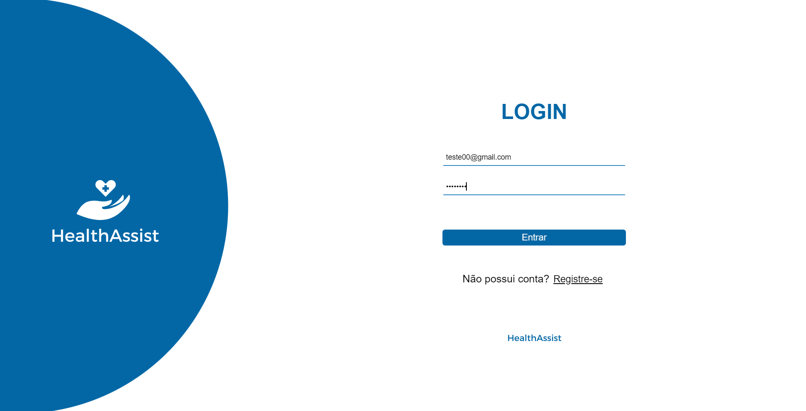

**Caso de Teste** | **CT04.1 - Adminstração: Aprovar ou recusar novos cadastros**
 :--------------: | ------------
**Procedimento**  | Aprovar ou rejeitar novos cadastros.
**Resultado obtido** | Mudança do campo 'aprovação' no Banco de Dados.

**Registro do Teste:**

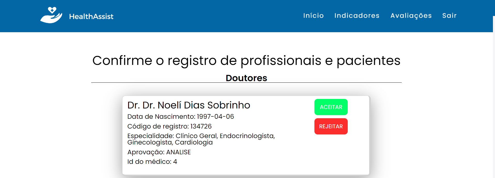
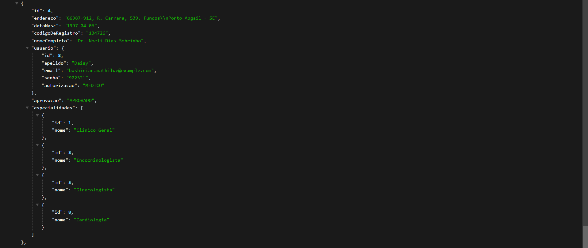
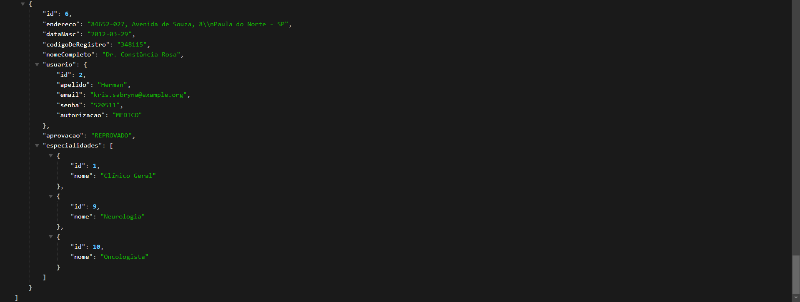
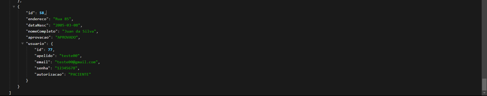

**Caso de Teste** | **CT04.2 - Paciente: cadastro aprovado, tentando acessar o HealthAssist**
 :--------------: | ------------
**Procedimento**  | Inserindo dados no login.
**Resultado obtido** | Redirecionamento para a home.

**Registro do Teste:**

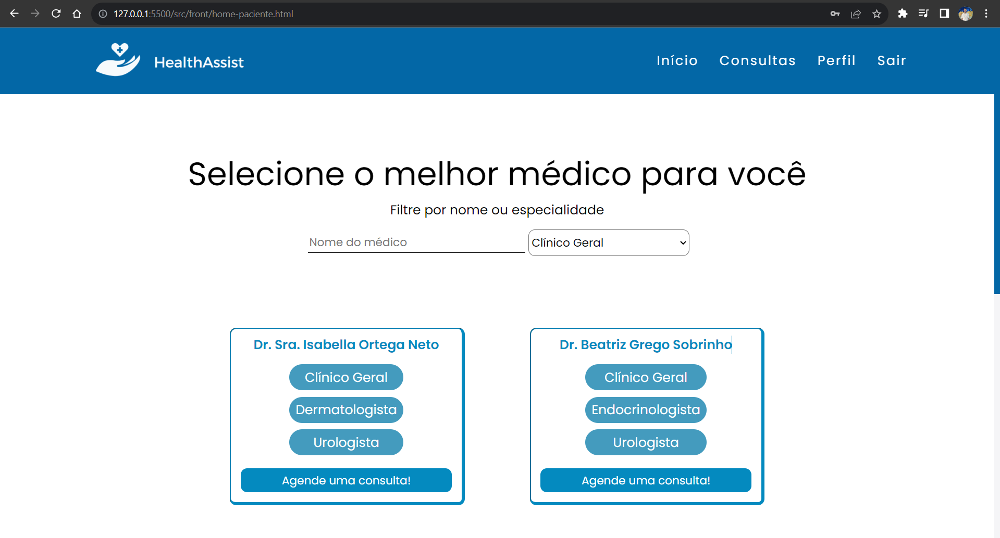

**Caso de Teste** | **CT04.3 - Paciente: cadastro reprovado, tentando acessar o HealthAssist**
 :--------------: | ------------
**Procedimento**  | Inserindo dados no login.
**Resultado obtido** | Redirecionamento para a página de rejeição.

**Registro do Teste:**

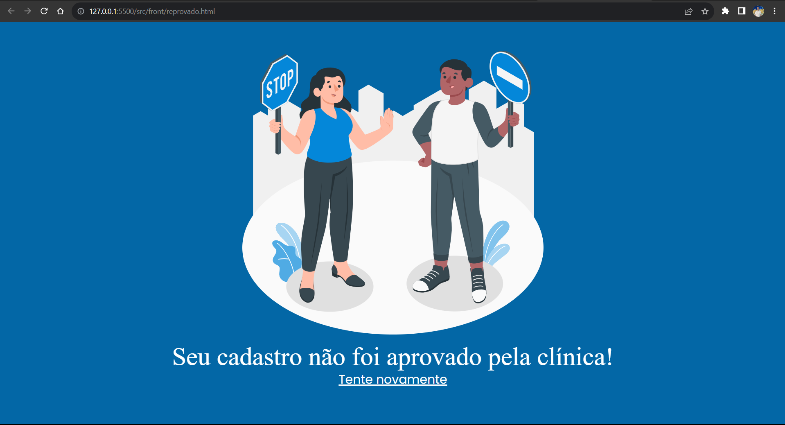

**Caso de Teste** | **CT04.4 - Médico: cadastro aprovado, tentando acessar o HealthAssist**
 :--------------: | ------------
**Procedimento**  | Inserindo dados no login.
**Resultado obtido** | Redirecionamento para a home.

**Registro do Teste:**

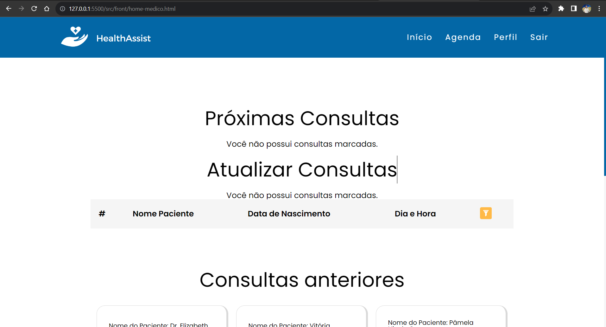

**Caso de Teste** | **CT04.5 - Médico: cadastro reprovado, tentando acessar o HealthAssist**
 :--------------: | ------------
**Procedimento**  | Inserindo dados no login.
**Resultado obtido** | Redirecionamento para a página de rejeição.

**Registro do Teste:**

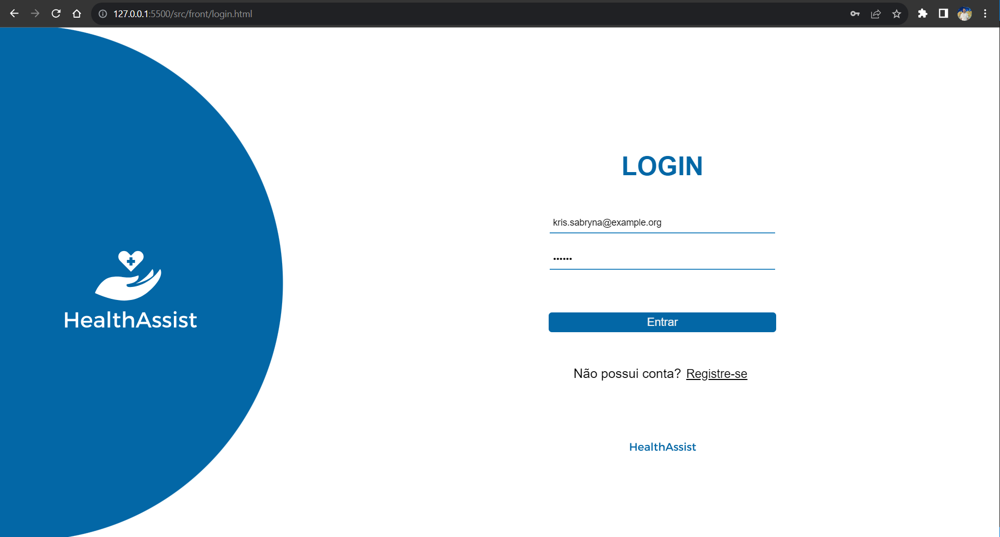

**Caso de Teste** | **CT05 - Médico, Paciente, Administração: tentar acesso à páginas não autorizadas**
 :--------------: | ------------
**Procedimento**  | Alterar a url manualmente.
**Resultado obtido** | Redirecionamento para a página de erro 404, pois as páginas possuem autorização.

**Registro do Teste:**

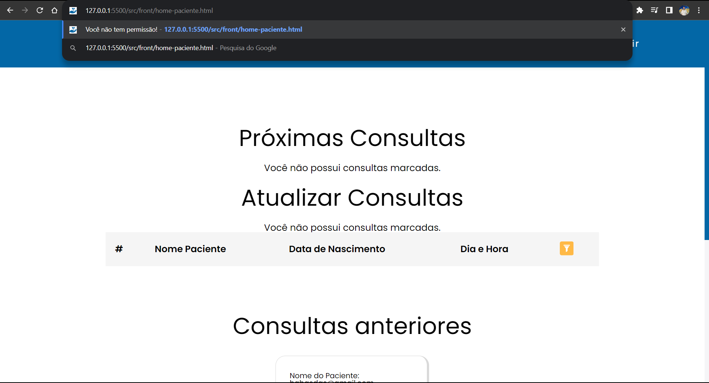
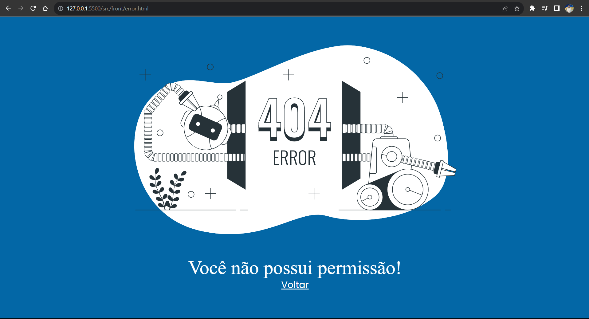

**Caso de Teste** | **CT06 - Marcar nova consulta**
 :--------------: | ------------
**Procedimento**  | Marcar nova consulta. 
**Dados de entrada** | Selecionar data e horário. 
**Resultado obtido** | Consulta registrada com sucesso. 

**Registro do Teste:**

**Caso de Teste** | **CT07 - Gerenciar horários**
 :--------------: | ------------
**Procedimento**  | Gerenciar consultas e horários do seu dia. 
**Resultado obtido** | Análise na agenda pessoal e na home. 

**Registro do Teste:**

**Caso de Teste** | **CT08 - Atualizar anamnese**
 :--------------: | ------------
**Procedimento**  | Atualizar anamnese. 
**Dados de entrada** | Inserção de dados válidos no formulário de atualização. 
**Resultado obtido** | Dado cadastrado com sucesso. 

**Caso de Teste** | **CT09 - Avaliar consulta**
 :--------------: | ------------
**Procedimento**  | Avaliar consulta. 
**Dados de entrada** | Inserção de dados válidos no formulário de avaliação. 
**Resultado obtido** | Dado cadastrado com sucesso. 

**Caso de Teste** | **CT10 - Avaliar consulta não terminada**
 :--------------: | ------------
**Procedimento**  | Avaliar consulta que não foi terminada. 
**Dados de entrada** | Inserção de dados válidos no formulário de avaliação. |
**Resultado obtido** | Dado não cadastrado. |

